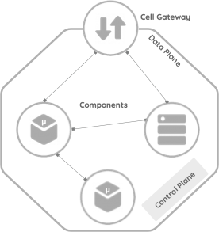

# Reference Architecture for Agility
+ Asanka Abeysinghe, Vice President - Architecture, CTO Office | asankaa@wso2.com
+ Paul Fremantle, CTO and Co-Founder | paul@wso2.com

> *This document describes a reference architecture for modern agile digital enterprises. This reference architecture offers a logical architecture based on a disaggregated cloud-based model that can be instantiated to create an effective and agile approach for digital enterprises, deployed in private, public or hybrid cloud environments. In this paper we present the architecture, the approach to applying this architecture, and existing approaches that fit into this architecture. The architecture defined in this paper can be mapped to current architectures as well as used to define new architectures. It is designed to help move from the “as-is” towards the “to-be”.*

## Introduction

Enterprise architecture has one main aim-to bring structure and organization to evolving systems, thus enabling better maintainability, flexibility, and agility. Enterprise architects have the unending task of trying to bring order to chaos. Over the past five years, a rapid shift has taken place in the agility of software development and in particular DevOps. As a result, continuous integration and continuous deployment (CI/CD) approaches have dramatically accelerated the time needed for new deployments of software projects from months to weeks to days to hours. In many ways, enterprise architectures have struggled to adjust. This reference architecture aims to enable an agile enterprise by increasing the agility at the project level and take it to the enterprise level.
This architecture is based on experience working across hundreds of projects on building digital systems. It also offers a forward-looking view aimed at addressing emerging challenges. The aim of this architecture is to enhance agility at the enterprise level. We define agility as the ability of an organization to respond effectively and in good time to changes in the business environment, in customer requirements, or in enterprise strategy. Agility is not just about one-time changes. It's about ongoing, repeated adaptation to meet the challenges of the enterprise. In creating agility, we assert that four properties are key:

+ **Scalaility**, the ability to deal with changing workloads by utilizing available resources and effectively maintaining a service level. Modern cloud infrastructure allows components, such as containers, to be scaled effectively, provided they are designed in the correct manner

+ **Modularity**, is the idea that components of the architecture are versioned, replicable, and have well-defined interfaces. It is about exposing the right interfaces into a versioned system as well as hiding the details of the internal workings.

+ **Composability**, is about creating a recursive and uniform architecture where new components and capabilities add to the overall platform in a seamless way. For example, adding business logic in a web page makes it hard for other systems to build on top of that logic, whereas adding the same logic to an API allows web applications, mobile apps, and other server-based systems to access that logic.

+ **Governance**, is about building managed, monitored, resilient systems and ensuring that organizational policies are enforced.

The rest of the this paper is structured as follows:

+ **Section 1**: Introduces the overall abstractions used.

+ **Section 2**: Introduces to the units of an enterprise architecture.

+ **Section 3**: Defines the new reference architecture. This includes a mapping to a real-world example.

+ **Section 4**: Discusses structured agility and looks at how the reference architecture augments an iterative architecture.

+ **Section 5**: Looks at how the reference architecture supports enterprise features.

+ **Section 6**: Examines the overall picture by describing the agile business from the business architecture point of view.

## Section 1: Abstractions

| Icon | Name | Description |
|---------|---------|---------|
|| User |A user is a human interacting with the system. Users can be external customers of the organization, internal employees, or partners.|
|| Component| A component is the atomic unit of this reference architecture. A component represents a process or business logic running in a container, serverless environment, or an existing runtime. This can then be categorized into many subtypes based on the functional capabilities. A component is designed based on a specific scope, which can be independently run and reused at the runtime. Runtime requirements and the behavior of the component vary based on the component type and the functional capabilities. The user may decide to build and run the code as a service, function, or microservice, or choose to reuse an existing legacy service based on the architectural need.  |

### Component Types: Main Categories

| Icon | Category | Component |
|---------|---------|---------|
||Legacy and data services|Databases, Existing systems, Registries and repositories, User stores, Business processes|
||Microservices and serverless components|Core business logic, Aggregation and service composition, Transformation|
||Gateways and brokers|Exposed APIs, events, and streams, Policy enforcement points, Message brokers, Identity brokers and identity gateways, Sidecars and bridges|
||External endpoint|Access using APIs, events,  and streams, Cloud systems and SaaS|
||Frontend clients|Mobile apps, Reactive apps, API consumers|
||Governance and utilities|Registry, Observability, Automation tools|

## Section 2: Cell - The Units of an Enterprise Architecture

A cell is a collection of components, grouped from design and implementation into deployment. A cell is independently deployable, manageable, and observable.
Components inside the cell can communicate with each other using supported transports for intra-cell communication. External communication must happen through the edge-gateway or proxy, which provides APIs, events, or streams via governed network endpoints using standard network protocols.
A cell can have 1:n components grouped. Components inside the cells are reusable and can instantiate in multiple cells. The cell should document its offers. The capabilities of a cell must be network accessible endpoints. In addition, if the cell needs access to external dependencies, then these must also be exposed as network endpoints through a cell-gateway. These endpoints can expose APIs, events, or streams. Any interfaces that the microservices or serverless components offer that are not made available by the control point should be inaccessible from outside the cell. Every component within the cell should be versioned. The cell should have a name and a version identifier. The versions should change when the cell’s requirements and/or offers change.

