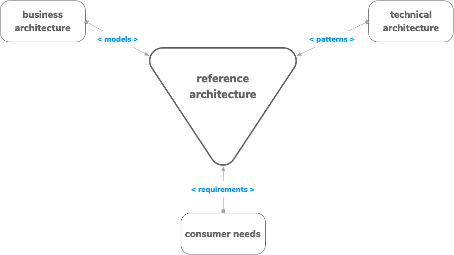
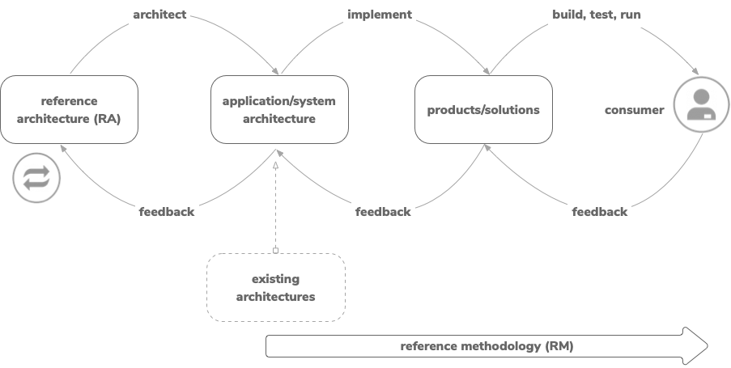

# Reference Architecture for Agility

## Emerging Reference Architectural Patterns

+ ### [Cell-based Reference Architecture](reference-architecture-cell-based.md)
  
+ ### Segmented Reference Architecture
  
+ ### Layered Reference Architecture

A Proven approach to helping every development organization become an integration agile organization. The Reference Architecture for Agility is a technology nutral logical architecture based on a disaggregated cloud-based model. It can be applied in incremental stages to create an integration agile foundation for any digital enterprises - deployable in private, public or hybrid cloud environments.

## Creating the Reference Architectrue

## Applying the Reference Architecture

