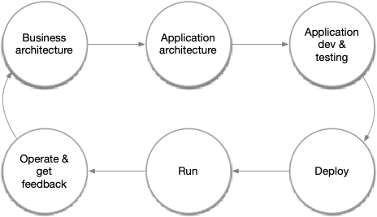

<h1 align="center"> Internal Developer Platform </h1>
<h3 align="center"> A Technical Reevaluation </h3>

<i>
Version: 0.7 (Fall-2023) 
</i>

**_Author_**

+ [Asanka Abeysinghe](https://www.linkedin.com/in/asankaabeysinghe/) | CTO - [WSO2, LLC](https://wso2.com/) | [@asankama](https://twitter.com/asankama)

> *In the ever-evolving field of software development and delivery, the term **"Internal Developer Platform"** (IDP) has often been confined to delivery and infrastructure automation. This narrow understanding overlooks crucial components, including application architecture, development, and production runtime. This article aims to correct this misinterpretation by offering a more comprehensive and nuanced definition. Through an in-depth analysis, this article will explore the multifaceted nature of internal developer platforms, breaking down the misconceptions and providing a well-rounded view that resonates with technical decision-makers and software application architects. By focusing on the real scope and potential of these platforms, we will shed light on what they truly encompass, extending beyond the conventional boundaries to reveal the complete landscape of modern software development practices.*

## What is a Platform?

Think of a platform like a bustling train station or an efficiently organized airport. These are not just transit points for the comings and goings of travelers. They are complex, multi-layered ecosystems that provide a wide array of services and functions. From shops, restaurants, and cafes to information kiosks, lounges, and even art installations, these hubs are miniature cities in themselves.

These elements don't exist in isolation; they interact and support each other. For instance, the information kiosk helps you find your way to the right terminal or track; the lounges offer a comfortable waiting area; the shops and eateries cater to your immediate needs, and digital displays keep you updated on schedules and delays. Each component serves a particular role, contributing to a seamless experience that accommodates a multitude of needs and preferences.

Moreover, these platforms are constantly evolving. New services are introduced, layouts are optimized, and feedback is actively collected to adapt to the changing requirements of the community they serve—travelers, employees, service providers, and more.

In essence, real-world platforms like these are supporting structures built to increase the effectiveness and productivity of a large and diverse community, mirroring Dave Gray's apt definition: 

> **"A platform is a supporting structure that increases the effectiveness of a community."** 

Whether it's about guiding, informing, feeding, or entertaining, each element within these platforms is fine-tuned to contribute to a harmonious, effective ecosystem.

In technology terms, a platform serves as a foundation or a framework that enables the development, deployment, and scaling of applications. It provides a set of tools, services, and capabilities that can be leveraged for various phases of software or product lifecycle. A well-architected platform abstracts complexities, offers reusable components, and enables interoperability between disparate systems. More than just a piece of technology, it's an ecosystem that influences both operational efficiencies and strategic capabilities. Understanding what a platform is at its core sets the stage for grasping the more specialized roles that specific types of platforms, like Internal Developer Platforms, play in technology ecosystems.

In the above diagram, the platform is represented as a foundation, serving as the base upon which all other activities and functions rest. Sitting atop the platform are interlinked squares labeled as 'Pods' or 'Domains.' These serve as compartments or subdivisions that group related functions and activities. Within each Pod or Domain, you'll find circles labeled as 'Components.' These components represent the individual workloads or tasks that the platform is designed to manage or execute. Just as in a train station, where different platforms serve specific train lines and each train has its specific compartments and cargo, this diagram illustrates how a technology platform organizes various workloads into logical groups (Pods/Domains), making it easier to manage, scale, and deploy them. The encapsulation within Pods or Domains provides an additional layer of organization, facilitating more efficient governance and operational management.

## Modern technology platform requirements 

In today's digital age, customer experiences are the driving force behind organizational differentiation. These experiences are increasingly delivered through software, blurring the lines between traditional industry categories. Whether you're in retail, healthcare, hospitality, or any other sector, your organization is, in essence, also a software company.

A modern technology platform should, therefore, be capable of designing, creating, and delivering these unique digital experiences. This goes far beyond merely offering a set of APIs or an environment where code can be executed. A comprehensive platform addresses the end-to-end life cycle of application development, starting from business architecture and extending to application architecture, application development, and testing.

But the life cycle doesn't stop at deployment. A robust platform must also offer tools for running and operating these applications, ensuring they meet performance, security, and scalability requirements. Lastly, it must facilitate the gathering of feedback and insights, enabling continuous improvement and adaptation. This comprehensive approach ensures that the platform serves not merely as a set of disjointed tools but as a cohesive ecosystem enabling organizations to be agile, innovative, and customer-centric.

By encompassing the full spectrum of application development, from ideation to operation, modern platforms empower organizations to deliver differentiated experiences effectively and efficiently. Therefore, when evaluating technology platforms, the ability to support this complete life cycle should be a prime consideration.

### The enterprise abstraction for enhanced productivity and simpicity 

As technologists, we are in the business of building experiences, and every line of code we write contributes to shaping those experiences. In this sense, the software industry is akin to the movie industry, where creativity thrives and innovation takes center stage. Just as filmmakers use storytelling techniques, cinematography, and special effects to captivate audiences, software developers rely on powerful abstractions to unleash their creative potential and deliver remarkable experiences. 

In software development, abstractions offer simplicity and convenience. They enhance our creative efforts by providing intuitive interfaces, hiding the underlying complexities, and empowering us to work at higher levels of understanding and productivity. In this context, a platform serves as a critical abstraction layer that enterprises can leverage to achieve these benefits.

### Quadruple layers of enterprise abstractions
Hand in hand with software abstractions we must also embrace the power of enterprise abstractions to unlock the full potential of our creative endeavors in the software industry. These abstractions are specifically designed to tackle the unique challenges and complexities of the enterprise landscape, enabling us to develop scalable, secure, and efficient solutions that drive business success. By leveraging these enterprise abstractions, we can build robust architectures, streamline business processes, and transform the way organizations operate in the digital age.

To understand enterprise abstractions, it is useful to review "The Quadruple Layers: Levels of Enterprise Abstractions," which has emerged as a guiding principle. This powerful framework contains four key layers in which each layer represents a distinct level of abstraction — deployment, middleware, business, and domain — that contributes to the overall efficiency and effectiveness of enterprise systems.

#### Deployment Abstractions
Deployment abstractions encompass a wide range of practices and tools that facilitate efficient application hosting and deployment within an enterprise environment. These abstractions include continuous integration/continuous deployment (CI/CD), DevOps, GitOps, SecOps, observability, multi-cloud strategies, zero-trust security measures, scalability, and high availability. Collectively, these deployment abstractions form the foundation for efficient, secure, and scalable enterprise software deployments, empowering organizations to meet the demands of modern technology landscapes.

#### Middleware Abstractions
Middleware abstractions serve as the intermediary layer that facilitates communication and data management between deployment and business abstractions. They play a key role in system integration, enabling seamless data flow and connectivity between disparate parts of an enterprise system. Middleware abstractions include elements like message brokers, API gateways, and data transformation tools.

#### Business Abstractions
Business abstractions encompass a set of concepts and practices that focus on modeling and automating core business processes within an enterprise. These abstractions include services or microservices, functions, APIs, events, data, and more. They form the building blocks for designing and implementing agile, scalable, and modular enterprise solutions, allowing organizations to respond to changing market needs quickly and efficiently.

#### Domain Abstractions
Domain abstractions, a subset of business abstractions, play a crucial role in tailoring software solutions to specific industry or domain requirements. These abstractions are grouped according to teams and capabilities, as guided by Conway's Law. By aligning software design with the boundaries of the business domain, domain-driven design (**DDD**) allows teams to develop a deep understanding of the problem space and create focused, autonomous teams. [**Cell-based Architecture**](https://github.com/wso2/reference-architecture/blob/master/reference-architecture-cell-based.md) can serve as an effective implementation strategy for these domain abstractions. This empowers teams to deliver tailored software solutions that address the unique needs and complexities of their industry or domain with speed, flexibility, and scalability.

In the diagram above, we provide a granular view of the "Quadruple Layers: Levels of Enterprise Abstractions" within a typical enterprise context. The visualization showcases how each abstraction layer — Deployment, Middleware, Business, and Domain — interacts and aligns with various technologies, users, and components integral to an enterprise. This detailed breakdown serves to elucidate the complexity and interconnectivity across the layers, giving you a comprehensive insight into how these abstractions collectively form the backbone of enterprise software architecture.

#### Digital channels for enteprise abstractions 
With the establishment of the Quadruple Layers of Enterprise Abstractions, which now include Deployment, Middleware, Business, and Domain layers, organizations gain a comprehensive foundation for constructing robust and efficient applications across various digital channels. These channels encompass web, mobile, Internet of Things (IoT), and other emerging platforms.

Websites and web applications provide a digital interface accessible through browsers, enabling users to interact and consume services. Mobile applications offer a personalized and on-the-go experience, leveraging the capabilities of smartphones and tablets. The Internet of Things (IoT) adds connectivity to everyday objects, facilitating seamless interactions and data exchange. Emerging technologies like virtual reality (VR), augmented reality (AR), and mixed reality (MR) introduce new realms of immersive experiences.

By tapping into the power of these digital channels and the four underlying layers of enterprise abstractions, organizations can develop innovative, user-centric applications that meet a variety of needs and preferences. This adaptability enables them to remain competitive in a swiftly changing digital landscape.

The emergence of platform engineering—focused on designing and building toolchains and workflows for software development teams' self-service—underscores the growing importance of creating flexible, modular, and composable tech solutions. While the upside is clear, enterprises must weigh the financial and resource implications of such undertakings. Building and maintaining these complex platforms require careful assessment of costs, challenges, and the presence of viable alternatives.

## Rise of the internal developer platform (IDP)
Enterprise abstractions, also known as the platform that CIOs are building, are collectively referred to as the internal developer platform (IDP). The IDP serves as a centralized foundation for the organization's software development and delivery processes, and it provides a comprehensive set of tools, services, and abstractions that enable development teams to work efficiently and effectively. Notably, the IDP encompasses all three enterprise abstraction layers: deployment, business, and domain, providing a holistic framework for building, deploying, and managing applications. 

By leveraging the IDP, organizations can streamline their software development lifecycle, foster collaboration among teams, and accelerate the delivery of high-quality applications. The IDP empowers developers by offering self-service capabilities, automation, observability, and scalability so they can focus on innovation and deliver exceptional digital experiences. As CIOs recognize the need for these enterprise abstractions, the IDP emerges as a strategic investment that transforms the way organizations develop and deliver software solutions.

## Traditional IDP definition

The current definition of the IDP, as outlined by [internaldeveloperplatform.org](https://internaldeveloperplatform.org/what-is-an-internal-developer-platform/), can be summarized as follows:
The IDP is designed to provide a framework and set of tools to support software development within an organization. It encompasses several core components and capabilities, including application configuration management, infrastructure orchestration, environment management, deployment management, and role-based access control. These components collectively contribute to streamlining the software development process, enhancing collaboration, and accelerating the delivery of high-quality applications. 

| Core Component               | Short Description                                           |
|-----------------------------|------------------------------------------------------------|
| Application Configuration Management | Manage application configuration in a dynamic, scalable, and reliable way.  |
| Infrastructure Orchestration | Orchestrate your infrastructure in a dynamic and intelligent way depending on the context.                  |
| Environment Management       | Enable developers to create new and fully provisioned environments whenever needed.                               |
| Deployment Management        | Implement a delivery pipeline for Continuous Delivery or even Continuous Deployment (CD).                            |
| Role-Based Access Control   | Manage who can do what in a scalable way.                  |

*source [internaldeveleporplatform.org](https://internaldeveloperplatform.org/core-components/)

However, it's important to note that this definition primarily addresses a subset of deployment abstractions and may not encompass the broader landscape of essential business and domain abstractions.

## The imperative to redefine the Internal Developer Platform
### Bridging Gaps and Overcoming Limitations

## References 

[1] Weerawarana, S., Dr. (2021, December 7). What Are the Right Abstractions for Cloud-Native Deployment? https://wso2.com/summits/. https://wso2.com/blogs/thesource/right-abstractions-cloud-native-deployment/

[2] How do Internal Developer Platforms (IDPs) relate to other concepts? (2023, February 9). Internal Developer Platform. https://internaldeveloperplatform.org/how-do-internal-developer-platforms-relate-to-other-concepts/

[3] Liebenberg, C. (n.d.). How to Design an Internal Developer Platform. https://blog.container-solutions.com/how-to-design-an-internal-developer-platform

[4] Fowler, M. (n.d.-b). bliki: Conway’s Law. martinfowler.com. https://martinfowler.com/bliki/ConwaysLaw.html

[5] Vernon, V. (2013). Implementing Domain-driven Design. Pearson Education https://www.pearson.com/en-us/subject-catalog/p/implementing-domain-driven-design/P200000009616/9780133039887

[6] Abeysinghe, A., & Fremantle, P. (2018, June). Cell-based architecture: A decentralized reference architecture for cloud-native applications. https://github.com/wso2/. https://github.com/wso2/reference-architecture/blob/master/reference-architecture-cell-based.md

[7] Gray, Dave, and Thomas Vander Wal. 2014. The Connected Company. O’Reilly Media https://www.oreilly.com/library/view/the-connected-company/9781449336622/

[def]: /media/platform-real-world.png