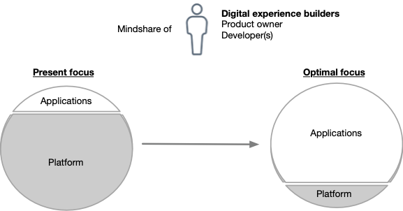
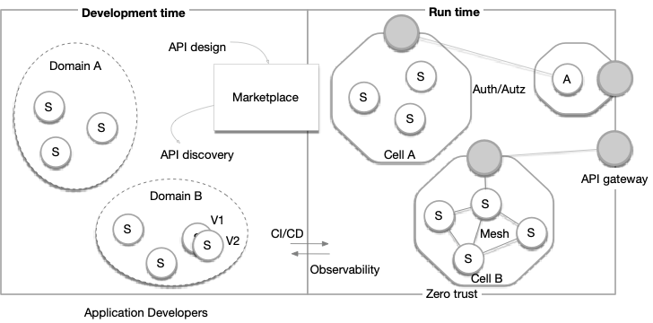

<h1 align="center">Platformless</h1>
<!-- <h1 align="center"> Facilitating Enterprise Software Engineering with Platformless</h1> -->
<!-- <h2 align="center"> Radically Improving Enterprise Software Engineering with Platformless</h2>-->

<i>
Version: 1.0 (Summer-2024) 
</i>

**_Authors_**

+ [Sanjiva Weerawarana, Ph.D.](https://www.linkedin.com/in/sanjivaweerawarana/) | Founder, CEO & Head of Products - [WSO2](https://wso2.com/) | [@sanjiva](https://x.com/sanjiva)
+ [Paul Fremantle, Ph.D.](https://www.linkedin.com/in/paulfremantle/) | Co-Founder, Founder CTO & Advisor - [WSO2](https://wso2.com/) | [@pzfreo](https://x.com/pzfreo)
+ [Asanka Abeysinghe](https://www.linkedin.com/in/asankaabeysinghe/) | CTO - [WSO2](https://wso2.com/) | [@asankama](https://twitter.com/asankama)

## Introduction

Radical simplification is at the heart of many major shifts in the enterprise application space:
+ **From wired to wireless**: transitioning beyond the physical limitations of wires ("wireless")
+ **From client-server to web and mobile**: not needing to worry about delivery and deployment of specific clients (“client-less”)
+ **From datacenter to cloud**: not needing to worry about hardware (“data-centre-less”)
+ **From app server to serverless**: not needing to care about which application server and having to manage clusters

Of course, when we talk about “-less” to indicate a shift, e.g., in serverless, it doesn’t really mean that there is no server. It simply means that there is such a clear boundary between the user and the provider that the user no longer needs to know about the system behind the service. For example, serverless backends still need clustering, failover, deployment, system upgrades, etc. However, the user of serverless doesn’t see any of that; they simply write and deploy code.

Now the need for radical simplification in enterprise software engineering is driving the next major shift: from **platforms** to **“platformless.”**

In this manifesto, we examine the challenges that organizations face with enterprise software delivery platforms, provide a definition of platformless, and discuss how a platformless approach facilitates enterprise software engineering.

## The Problem with Platforms

Recently we have seen the rise of enterprise software delivery platforms. Often these build on Kubernetes or other cluster management systems, together with DevOps pipelines and monitoring and management systems among many other aspects. These platforms are incredibly powerful and allow organizations to deploy applications at scale and speed. More importantly, they enable updates to be deployed, rolled out incrementally, and rolled back if necessary. 

Platforms allow massive agility in improving application function and performance — which are characteristics closely associated with business success.

However, platforms have introduced their own challenges. They require large, highly-skilled platform engineering teams, and the skills are hard to find. Each platform requires many complex choices and links between multiple systems: DevOps pipelines, deployment management, monitoring and management systems, network substrates, and of course the actual cluster management.

It is clear that we need a new paradigm to remove the platform from our consciousness and allow us to code, build, and deploy enterprise applications with fast deployment, continuous integration and rollout, and world-class monitoring and management - but with no need to see and manage the platform itself. 

  

  <i>
    Figure 1: Enterprise IT needs to increase focus on applications and less on the platform.
  </i>

We call this **“Platformless”**. That doesn’t mean the platform vanishes completely. Rather, by building the right boundary we can hide it from our consciousness and therefore remove the complexity it brings. Platformless has the potential to be as big a shift as the web or cloud. Web reinvented the concept of a client. Cloud reinvented the concept of server hardware. Platformless reinvents the concept of server-side development and deployment.

## What is Platformless?

Platformless is delivered by the seamless marriage of four technology domains: 

**
Platformless = Platform Engineering ( API-First + Cloud Native Middleware + Developer Experience )
**

Platform engineering is the foundation for a platformless experience. It constructs [internal developer platforms (IDP)](https://github.com/wso2/reference-architecture/blob/master/internal-developer-platform.md), merging DevOps and site reliability engineering (SRE) to fully empower enterprise developers.

APIs are the fundamental building blocks of modern software. Cloud native middleware serves as the runtime infrastructure essential for building and running cloud native distributed systems. It provides the necessary components to build applications efficiently.

An exceptional developer experience (DX) that liberates and empowers developers to operate autonomously and securely is the ultimate benefit of a platformless approach. This shift allows the focus to move from platforms to applications.

This combination supports the entire lifecycle of enterprise software engineering, delivery, and operations, delivering a platformless experience for the enterprise. Consider the following example:

> **Creating in a Platformless world:**
> + *Maria, a seasoned lead developer at TechFirm Alpha, is entrusted with constructing end-user applications for internal and external users. Her role involves integrating the company's system of records (SOR), which encompasses an in-house customer relationship management (CRM) system, with numerous external e-commerce platforms. Maria is integral to the 'customer' domain, contributing her expertise to the two-pizza team.*
> + *She logs into the internal developer platform's development environment and navigates to its built-in marketplace. Maria looks up the existing APIs and checks the functionality she needs for application development. She subscribes to the required APIs but finds that not all the capabilities are available, so she decides to implement a few new APIs.*
> + *She uses her favorite IDE, programs a service using a language of her choice (from amongst the languages her company has approved) and commits the code. Returning to the platformless development environment, she selects the available connection configurations for development, deploys the automatically built integration, and runs tests. The platformless architecture automatically ensures zero-trust deployment.*
> + *She creates an API out of the service and defines it as an internal API. When ready, she promotes the API to a staging environment and shares it with her colleagues for verification. After validation, she promotes the API to the production environment, inheriting production configurations set up by her company for all the APIs she is consuming.*
> + *She and her colleagues can manage the API using the monitoring, tracing, and observability tools provided by the platformless environment. Over time, she or another team member modifies the API to meet new requirements. She creates a separate deployment of the new branch of the code, follows the development process, and eventually performs release management to upgrade the integration.*
> + *Maria is now running an evolving API in a scalable, zero-trust environment without ever losing focus on the original problem she solved: developing the integration.*

Now, let us explore in more detail the foundational element of platformless—platform engineering—and the three pillars: API-first, cloud native middleware, and developer experience (DX).

### API-First

Adopting an **"API-first"** approach has become the gold standard for an enterprise architecture to reap the benefits of the API economy approach to enterprise computing.

APIs provide a way to abstract away the details of some capability and simply to focus on using that capability over the network. Web and mobile applications have driven the growth of APIs as they necessarily interact through them. Further, any enterprise focused SaaS service will offer APIs to enable their customer systems to directly integrate.

Yet the use of APIs as the *lingua franca* within the enterprise is still developing. API-First is about ensuring that all functionalities within the enterprise are made available for reuse as APIs, events and data products that can be discovered and consumed easily, while still respecting the organizational and operational structure of the enterprise.

Critical capabilities to build an API-First approach to enterprise architecture include the following:

1. Use of API design tools to design and govern APIs to ensure consistency across the enterprise.
2. Use of API gateways at runtime to monitor and control both internal and externally visible APIs.
3. API marketplace for effortless API discovery and consumption, simplifying the way APIs are used and reused across the enterprise.
4. API management as an enabler for treating APIs as products and being able to manage all aspects of API products.

Most enterprises today still have focused "API programs" to enable this approach. In a platformless environment, all capabilities exposed over the network would "automatically" be APIs, be governed, be gatewayed and be managed. The enterprise focus moves to identifying the right designs for creating a set of APIs that becomes the SDK for the business.

### Cloud Native Middleware

Cloud native is widely accepted as the approach for building modern distributed systems that execute in containerized, scalable, secure, resilient, multi-cloud distributed environments. Yet building, deploying and operating cloud native systems requires significant investment in middleware technology to manage modularity, isolation and governance. These include domain-driven design, cell-based architecture, service meshes, integrated authentication and authorization, and zero-trust architecture. This middleware environment must enable enterprise architects to practice appropriate service architecture styles from microservices to monoliths to functions. It must also support non-network triggered jobs.

[Domain-driven design (DDD)](https://martinfowler.com/bliki/DomainDrivenDesign.html) helps coordinate business requirements with software solutions. Domains in this context are comprehensive, offering APIs, events, and data to ensure cohesive yet loosely coupled systems. [Cell-based architecture (CBA)](https://github.com/wso2/reference-architecture/blob/master/reference-architecture-cell-based.md) is an approach for modularizing a group of related capabilities from (part of) a domain into a network cell and managing access to them through well-defined gateways. Service meshes provide enhanced service-to-service communication, addressing challenges in interservice communication in microservice deployments to improve the resiliency of distributed systems. All access to any resource must be authenticated and authorized based on policies to ensure the safety and security of enterprise systems. Zero-trust architecture ensures that no component implicitly assumes trust and always verifies any and all interaction.

Building, deploying, operating and evolving all this infrastructure is difficult to impossible for most enterprises and results in a massive focus shift. Platformless delivers these capabilities as part of the fabric allowing the enterprise to instead focus on applications, services, APIs, automations and other digital assets that deliver value to their ecosystem.

### Platform Engineering

While designing and implementing good software while reusing existing capabilities is hard enough, the process of getting that code out to customers to use in a repeatable, retractable, reliable approach has long been a challenge for enterprises. 

Approaches such as DevOps and SRE have been widely adopted to solve this problem. The practice of DevOps is a software development and delivery approach that bridges gaps between development and operations teams. SRE is about ensuring system readiness and availability at the desired level. 

Platform Engineering is the domain of building toolchains and processes to enable enterprise developers to easily build, deliver and operate software in an empowered, self-service manner. The resulting product is now referred to as an [internal developer platform (IDP)](https://github.com/wso2/reference-architecture/blob/master/internal-developer-platform.md). These products support all the roles involved in enterprise software delivery including developers, testers, DevOps/AppOps engineers and SREs.

Capabilities of the Internal Developer Platform include:

1. Complete self-service for all roles with fine-grained permission management and complete auditability of all actions.
2. Release management capabilities to support rapid iteration and robust releases with strategies such as rolling updates, canary and blue-green.
3. Observability capabilities for all the roles of the enterprise so their focus can remain at their level: on innovation metrics like DORA metrics for CIOs, business analytics for product managers, runtime logs/metrics/traces for DevOps teams.

Platform Engineering and the resulting Internal Developer Platform are the lynchpin to facilitate platformless and allow all parties envolved with enterprise software engineering to have full focus just on the parts they are responsible for.

### Developer Experience

> *“Every company is a software company. You have to start thinking and operating like a digital company. It’s no longer just about procuring one solution and deploying one. It’s not about one simple software solution. It’s really you yourself thinking of your own future as a digital company.”* – Satya Nadella, CEO Microsoft, 2015.

The heart of software companies is "developers" in the broadest sense: product managers, product designers, software engineers, software testers, security teams, operations teams and so on. If an internal developer platform is the lynchpin of a great enterprise software engineering environment, then [developer experience](https://redmonk.com/sogrady/2020/10/06/developer-experience-gap/) (DX) is the fuel: Nothing runs without fuel.

DX is a measure of how easy and enjoyable it is for developers to work in the enterprise. While "easy and enjoyable" may not seem important, given that awesome digital experiences come from the creativity of awesome developers, they are much more likely to be productive, engaged, and innovative in such an environment vs. a boring one. This will lead to better quality software, faster time to market, and happier customers.

At its core, DX revolves around offering developers a seamless and intuitive environment for their complete work cycle. An integral part of this is tools such as integrated development environments (IDEs), command-line interfaces (CLIs), perfectly designed Web experiences, quality APIs, and super documentation. These tools not only simplify the creation of cloud-native components but also streamline debugging, testing, deployment, and operation processes.

Happy developers focus on applications, not platforms.

## Platformless Facilitates Enterprise Software *Engineering*

Enterprise software engineering is more complex than building independent products because enterprises are complex organisms with competing interests that must somehow be hidden when a customer engages with the business. Enterprises have large applications such as CRMs, ERP systems for various functions requiring any application to have a significant data integration responsibility, which is rarely the case in non-enterprise systems.

Further, as organizations become digital businesses, they need to produce not one piece of software but a large complex collection of software products that work together. The aim is to digitize the business and support human users (as web/mobile/desktop apps), non-human users (as network APIs), and programs that work with no external involvement (as jobs or automations). A large enterprise will often have thousands of such digital assets that need to work together.

The aim of platformless is to enable enterprises to build and deliver many digital experiences without the platform becoming the challenge. To succeed, platformless must enable building systems that span business domains, APIs, events, automations, workflows, and of course apps. It must support modularity, beautiful architecture, reuse, and security. It must also have world-class delivery: fast deployment, continuous integration and rollout, incisive monitoring, and intuitive management. 

  

  <i>
   Figure 2: Modern distributed systems easily built and operate in a platformless environment
  </i>

## Advantages of Adopting Platformless

**Accelerated market response**: platformless redefines the pace of development, sidestepping the usual delays linked to platform management. This shift allows for quicker product launches, significantly speeding up an organization's response to market demands and opportunities.

**Attainable best practices**: adopting platformless means embracing a realistic and sustainable approach to best practices. It negates the need for continuous updates and exhaustive research, making the achievement of high industry standards more accessible and less burdensome.

**Simplified complexity management**: the model of platformless stands out in its ability to minimize the complexities involved in building and maintaining platforms. This simplification allows teams to divert their focus and resources toward achieving strategic goals and honing core business functionalities.

**Streamlined team operations**: platformless advocates for a lean operational model. By reducing the need for extensive platform maintenance, it ensures that teams can concentrate their efforts on core business objectives, enhancing productivity and aligning with organizational goals.

**Reduced financial overhead**: one of the most significant benefits of platformless is its cost efficiency. By eliminating the substantial investments typically required for platform development and upkeep, platformless provides a more financially sustainable model, allowing for better allocation of people across the organization.

## Conclusion

Software delivery platforms and runtime platforms have had an amazing impact on the speed of delivery and scalability of enterprise applications and systems. But these were the forerunners for a simpler, more effective model. Platformless takes away the complexity of these systems while retaining and improving the experience for everyone involved in building, deploying, and running enterprise applications. Most importantly, platformless helps deliver even better applications to customers. 

## References

1. Abeysinghe, A., & Fremantle, P. (2018, June). Cell-based architecture: A decentralized reference architecture for cloud-native applications. https://github.com/wso2/. https://github.com/wso2/reference-architecture/blob/master/reference-architecture-cell-based.md
2. Compuware, Mike Burba. 2003. “Delivering the Holy Grail of Software Development.” Computerworld. October 22, 2003. https://www.computerworld.com/article/2572523/delivering-the-holy-grail-of-software-development.html.
3. Abeysinghe. A. 2023a. “Internal Developer Platform:  A Technical Reevaluation.” WSO2. October 2023. https://github.com/wso2/reference-architecture/blob/master/internal-developer-platform.md. 
4. Fowler, Martin. n.d. “Bliki: DomainDrivenDesign.” Martinfowler.com. https://martinfowler.com/bliki/DomainDrivenDesign.html.
5. Stephen O'Grady. 2020. "The Developer Experience Gap." Redmonk.com. https://redmonk.com/sogrady/2020/10/06/developer-experience-gap/.
6. Zakirullin. 2024. “GitHub - Zakirullin/Cognitive-load: 🧠 Cognitive Load Is What Matters.” GitHub. June 2024. https://github.com/zakirullin/cognitive-load.
