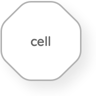
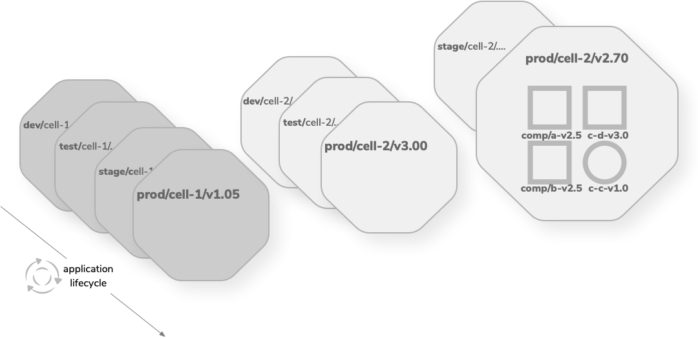
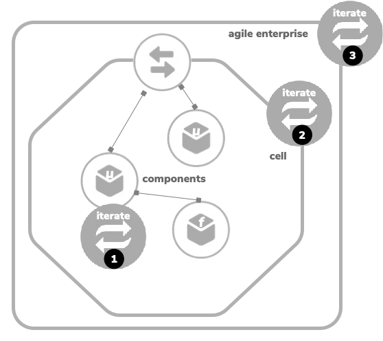
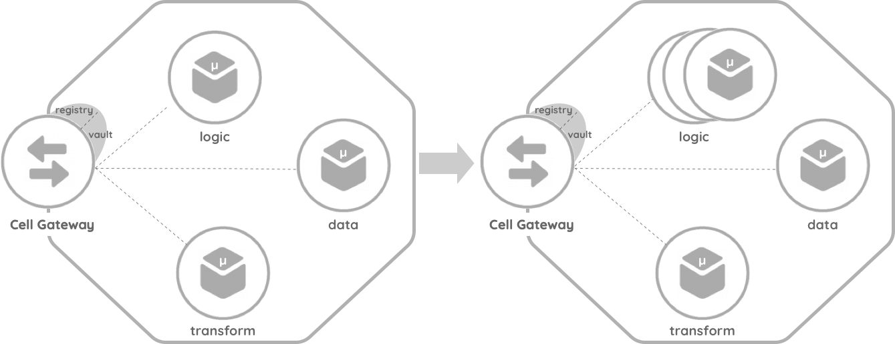
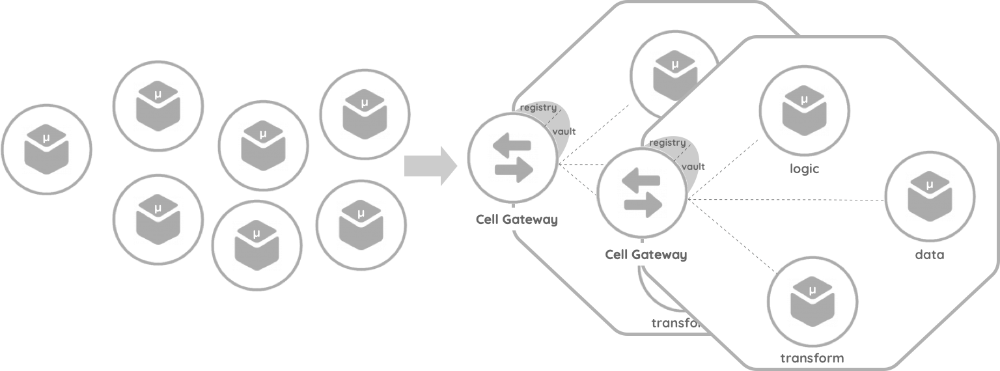
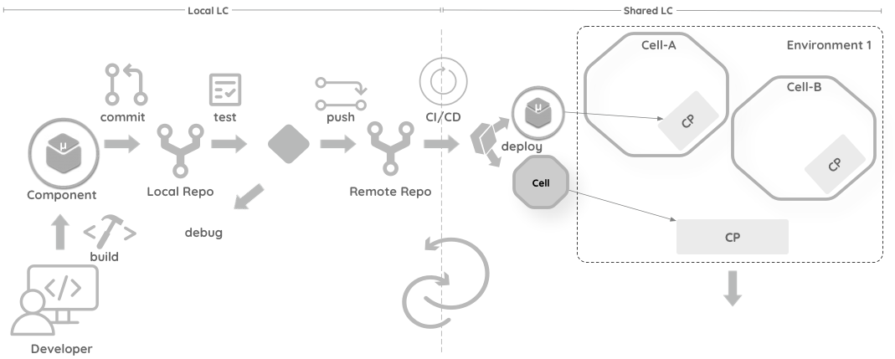
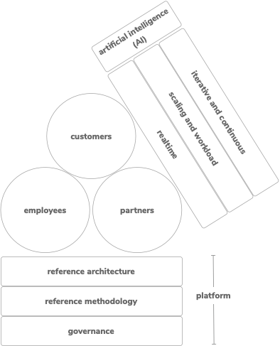
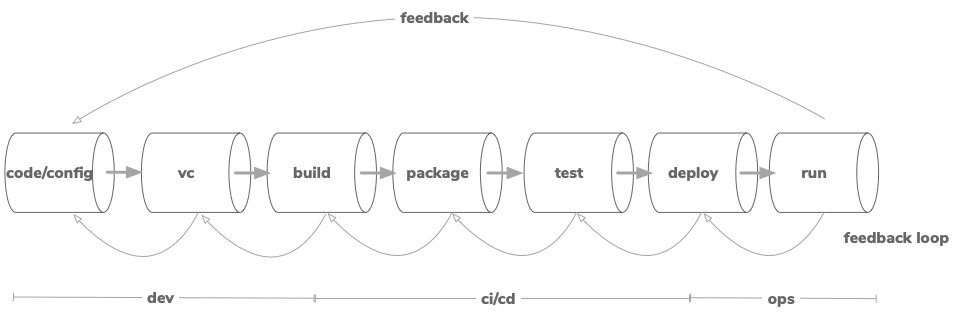

<h1 align="center"> Cell-Based Architecture </h1>
<h3 align="center"> A Decentralized Reference Architecture for Cloud-native Applications </h3>

<i>
Version: Fall-2021 
</i>

**_Current Author_**

+ Asanka Abeysinghe | Chief Technology Evangelist- [WSO2, Inc](https://wso2.com/) | [@asankama](https://twitter.com/asankama)

**_Original Authors_**

+ Asanka Abeysinghe | Chief Technology Evangelist- [WSO2, Inc](https://wso2.com/) | [@asankama](https://twitter.com/asankama) (Summer-2018 - Fall-2021)
+ Paul Fremantle | former CTO and Co-Founder - [WSO2, Inc](https://wso2.com/) | [@pzfreo](https://twitter.com/pzfreo) (Summer-2018 - Spring-2020)

> *This document describes a reference architecture for modern agile digital  enterprises. This reference architecture offers a logical architecture based on a disaggregated cloud-based model that can be instantiated to create an effective and agile approach for digital enterprises, deployed in private, public or hybrid cloud environments. In this paper we present the architecture, the approach to applying this architecture, and existing approaches that fit into this architecture. The architecture defined in this paper can be mapped to current architectures as well as used to define new architectures. It is designed to help move from the “as-is” towards the “to-be”.*

## Introduction

Enterprise architecture has one main aim-to bring structure and organization to evolving systems, thus enabling better maintainability, flexibility, and agility. Enterprise architects have the unending task of trying to bring order to chaos. Over the past five years, a rapid shift has taken place in the agility of software development and in particular DevOps. As a result, continuous integration and continuous deployment (CI/CD) approaches have dramatically accelerated the speed of new deployments of software projects from months to weeks to days to hours. In many ways, enterprise architectures have struggled to adjust. This reference architecture aims to enable an agile enterprise by increasing the agility at the project level and take it to the enterprise level.

This architecture is based on experience working across hundreds of projects on building digital systems. It also offers a forward-looking view aimed at addressing emerging challenges. The aim of this architecture is to enhance agility at the enterprise level. We define agility as the ability of an organization to respond effectively and in good time to changes in the business environment, in customer requirements, or in enterprise strategy. Agility is not just about one-time changes. It's about ongoing, repeated adaptation to meet the challenges of the enterprise. In creating agility, we assert that four properties are key:

+ **Scalability**, the ability to deal with changing workloads by utilizing available resources and effectively maintaining a service level. Modern cloud infrastructure allows components, such as containers, to be scaled effectively, provided they are designed in the correct manner

+ **Modularity**, is the idea that components of the architecture are versioned, replicable, and have well-defined interfaces. It is about exposing the right interfaces into a versioned system as well as hiding the details of the internal workings. Business mirroring with domain-driven design (DDD) is the foundation for defining modularity at the macro level. 

+ **Composability**, is about creating a recursive and uniform architecture where new components and capabilities add to the overall platform in a seamless way. For example, adding business logic in a web page makes it hard for other systems to build on top of that logic, whereas adding the same logic to an API allows web applications, mobile apps, and other server-based systems to access that logic.

+ **Governance**, is about building managed, monitored, resilient systems and ensuring that organizational policies are enforced.

The rest of the this paper is structured as follows:

+ [**Section 1**](#section-1-abstractions): Introduces the overall abstractions used.

+ [**Section 2**](#section-2-cell---the-units-of-an-enterprise-architecture): Introduces to the units of an enterprise architecture.

+ [**Section 3**](#section-3-structured-agility): Discusses structured agility and looks at how the reference architecture augments an iterative architecture.

+ [**Section 4**](#section-4-building-an-agile-enterprise-with-the-cell-based-architecture): Defines the new reference architecture. This includes a mapping to a real-world example.

+ [**Section 5**](#section-5-cell---recommendations-and-best-practices): Define the rules that can apply in the design, implementation and deployment of the cells.

+ [**Appendix-A**](#appendix-a-agile-enterprise): Examines the overall picture by describing the agile business from the business architecture point of view.

## Section 1: Abstractions

| Icon | Name | Description |
|---------|---------|---------|
|| User |A user is a human interacting with the system. Users can be external customers of the organization, internal employees, or partners.|
|| Component| A **component** is the **atomic unit** of this reference architecture. A component represents a process or business logic running in a container, serverless environment, or an existing runtime. This can then be categorized into many subtypes based on the functional capabilities. A component is designed based on a specific scope, which can be independently run and reused at the runtime. Runtime requirements and the behavior of the component vary based on the component type and the functional capabilities. The user may decide to build and run the code as a service, function, or microservice, or choose to reuse an existing legacy service based on the architectural need.  |
|| Cell| Cell - an architecture block represents by an **octagon**.|

### Component Types: Main Categories

| Icon | Category | Component |
|---------|---------|---------|
||Legacy and data services|Databases, Existing systems, Registries and repositories, User stores, Business processes|
||Microservices and serverless components|Custom business logic, Aggregation and service composition, Transformation|
||Gateways and brokers|Exposed APIs, events, and streams, Policy enforcement points, Message brokers, Identity brokers and identity gateways, Sidecars and bridges|
||External endpoint|Access using APIs, events,  and streams, Cloud systems and SaaS|
||Frontend clients|Mobile apps, Web apps, Portlets, Reactive apps, API consumers|
||Governance and utilities|Registry, Observability, Automation tools, Lifecycle management|

## Section 2: Cell - The Units of an Enterprise Architecture

A **cell** is a **collection of components**, grouped from design and implementation into deployment. A cell is independently deployable, manageable, and observable.
Components inside the cell can communicate with each other using supported transports for intra-cell communication. External communication must happen through the edge-gateway or proxy, which provides APIs, events, or streams via governed network endpoints using standard network protocols.

A cell can have 1:n components grouped. Components inside the cells are reusable and can instantiate in multiple cells. The cell should document its offers. The capabilities of a cell must be network accessible endpoints. In addition, if the cell needs access to external dependencies, then these must also be exposed as network endpoints through a cell-gateway. These endpoints can expose APIs, events, or streams. Any interfaces that the microservices or serverless components offer that are not made available by the control point should be inaccessible from outside the cell. Every component within the cell should be versioned. The cell should have a name and a version identifier. The versions should change when the cell’s requirements and/or offers change.

* A cell is an immutable application component that can be built, deployed and managed as a complete unit.
* A cell consists of multiple services, managed APIs, ingress and egress policies (including routing, throttling, and access control), security trust domain, deployment policies, rolling update policies, and external dependencies.
* The cell definition captures all of these in a standard technology-neutral fashion.

### Deep-Dive into Cells

In this example, **Cell-1** contains two microservices and a function operating with a microbroker and a microgateway to fulfill the functionality. The function is communicating with a few external services running outside the cell, and one microservice communicates with a cluster of external databases. The cell contains local storage, which is required by the microbroker. The functionality of a microservice in this cell has been extended by bringing a sidecar.

**Cell-2** contains a cluster of relational databases exposed via a Java Database Connectivity (JDBC) endpoint.

Components in **Cell-3** are running in a hypervisor-based virtualized environment with a few RESTful services, an application server runtime, and a business process. Cell-3 exposes its capabilities through an endpoint implemented via a traditional enterprise service bus (ESB) or an API gateway.

The concept of a cell moves away from centralized a enterprise architecture to a decentralized architecture. The segmented approach allows each cell to be independent and iterate individually.

#### Cell Gateway Communication

The cells consume the functionality of other cells using the three API types (request response, events and streams) exposed by the cell gateways.

+ **Request Response** API types provide an abstraction over everything that can be **queried** or **activated**.
  
+ **Events** allow action in real-time based on changes that occur in the environment, allowing work to be **triggered**.

+ **Streams** capture the ongoing evolving nature of the environment, allowing **pattern matching** and **analysis**.

A common characteristic of the usage among the three different types of endpoints is subscriptions. An application or a system is required to have an active subscription to send or receive messages/events from the applicable API type. The difference is how the messages/events are delivered and the underlying protocols used.
External cells represent endpoints exposed by the partners and the service provider ecosystem of the organization. External cells can be a software-as-a-service (SaaS) application, an integration or an API gateway encapsulating a set of functionality provided by the external counterpart.

#### Inter and Intra Cell Communication

This diagram brings the data plane, control plane and the management plane concept into the cell-based architecture.

| Code | Name | Definition |
|---------|---------|---------|
|**DP**|Data Plane|Forwards traffic between hops, takes data packets|
|**CP**|Control Plane|Signaling of the network, makes decisions about the traffic flow, runtime governance|
|**MP**|Management Plane|Configuration, observeabiltty, monitoring, design-time governance|

Components in a cell are required to communicate with each other in a seamless way, which we call intra-cell communication. Cells in a system architecture are required to communicate with each other through the edge-gateway, which we call inter-cell communication. As a result, a control-plane and a data-plane operate inside each cell along with a common control-plane, data-plane and management-plane outside the cells.

Communication planes inside a cell are called the **local mesh** and the communication planes outside the cells are called the **global mesh**. 

#### Governance of Cell-Based Architecture

The gateway is the control point for a cell-based architecture, which provides a well-defined interface to a subset of APIs, events, and streams. In this pattern, the gateway becomes the only access point (endpoint) for the cell. As a result, the gateway acts as a policy enforcement point, an observability touchpoint, and an enabler for governance frameworks. Additionally, the gateway pattern helps to implement architectures that comply with domain-specific technology or business standards.

The gateway pattern mandates the entire internal and external communication flow through a set of defined gateway clusters. Therefore, it is easy to enforce policies and capture the information required for observation from these gateways. This approach increases the agility of the overall architecture because the enforcements are introduced, managed, and maintained at the gateways without changing the rest of the associated components in the ecosystem.

#### Security of Cell-Based Architecture

Security of the cell-based architecture is an area that needs more detailed coverage than what is offered here. A paper devoted to a security reference architecture for an agile enterprise is planned to be published in the future. However, it is worth making a few high-level points here. The main point, which needs to be clear, is that the identity and security domain within a cell may be distinct from the domain outside the cell. For example, the cell gateway may replace tokens that are valid outside the cell with alternative tokens that operate within the cell. This is because the cell may need to operate its own security rules, policies, and approaches. This encapsulation ensures that the cell can migrate without affecting the externals users. 

However, some organizations may choose to operate a single continuous domain across multiple cells. The above diagram shows two common security patterns:

+ Pattern-1 offers a Security Token Service (STS) inside the cell, and the local STS of the cell contains the required security metadata to authorize and authenticate the incoming requests. STS is part of the local control plane; it stores the required policies and acts as a Policy Decision Point (PDP).

+ Pattern-2 connects to an identity provider (IDP) that resides in the conventional control plane, which is stationed outside the cells. Primarily, we would like to emphasize that the cell-based architecture can work on a local security model in the cell or extend to a federated security model (which is common) by connecting beyond the boundary of the cell. 

#### Lifecycle and Versioning of Cells

The lifecycle of a cell is similar to a typical application lifecycle. Each cell can have its own lifecycle stages based on the functionality, business criticality, and how the team owning the cell has organized the release pipeline. As described in the above diagram, Cell-1 is pipelined with four lifecycle stages (development, testing, staging, and production) while Cell-2 contains three lifecycle stages (development, testing, and production). A cell can have multiple active versions at a given time due to the interdependencies cells create with other cells in an enterprise. Each version of the cell contains a separate lifecycle and a release pipeline. As the above diagram explains, Cell-2 has two versions: v3.00 and v2.70; while v3.00 has three stages and v2.70 has two stages.

By utilizing modern container-based, cloud-native infrastructures, pre-production stages can spin up when required. As described in the diagram, v2.70 of Cell-2 does not have a “dev” phase (because it assumes that development is completed), but it can spin one up if needed to rollout a required a bug fix or a feature enhancement.

## Section 3: Structured Agility

One of the main advantages architects can gain from a cell-based architecture is the extended agility provided by the cells and isolation compared to the traditional layered architecture. As mentioned before, the cell-based approach divides the enterprise architecture into individual cells. As a result, there are three levels of iterative architecture that can be enforced.

+ Level-1: **Components** inside each cell can iterate individually.
+ Level-2: Each **cell** can iterate independently.
+ Level-3: The **enterprise architecture** can iterate as a whole.

Even though most large enterprises try to follow an iterative approach, projects are pushed to an agile-waterfall model due to the size and complexity of the systems. The cell-based approach divides these larger architectures into small chunks and facilitates iteration within. Each iterative step can version individually and manage the dependencies by sticking to the principles of loose-coupling.

### Cells and Agile Teams

#### Creation of Cells

Cell creation can take two approaches based on the current state of the organization. Greenfield projects can take a top-down approach by defining the cells first and developing the components after that. However, in a situation where the components are already developed and exist in the infrastructure, components can be reorganized by mapping them to cells. A combination of the above two methods is also a viable approach.

##### Scenario 1: Brand New Cell

A development team can start creating a cell before developing the components. In this scenario, the developer treats the cell as a composite. During the development process, the developer (cell owner/creator) and/or the teammates can add components to the cell. However, the cell should contain the essential components linked with the local mesh (DP and CP) before deploying the cell from the local sandbox environment.

##### Scenario 2: From Existing (Micro) Services

The second scenario comes when the components already exist or are built outside the cell boundary. The cell owner or the self-organized team members can create a new cell definition and include the components or edit an existing cell definition and introduce the new components.

#### Developer Flow

A new architecture paradigm can change the natural development flow, which might affect the productivity of the developers. However, cell-based architecture takes a developer-friendly approach that increases efficiency and adoption.

Developers implement components by writing code or configuration and testing it in their local sandbox environment. Once the units tests are passed, they push (or pull) the changes to the shared source control repository. At that point, the CI/CD process will kickoff and deploy the components into the cells based on the cell configuration defined by the cell owner. The CI/CD process takes the components and the cells through the configured application lifecycle stages. Deployment of the component can take two paths based on the immutability of the cell. Immutable cells (recommended) signal the global control-plane and deploy the entire cell for a component change. If the cell is mutable, it signals the local control-plane and deploys only the updated component.

The cell definitions can be created by using a programming language or infrastructure as a code script and utilizing the functionality provided by the targeted infrastructure.

## Section 4: Building an Agile Enterprise with the Cell-Based Architecture

One of the objectives of building a modern reference architecture is to enable adaptivity. Adaptivity is an organization’s ability to respond to changes in the environment, overcome new challenges, and meet new customer demands in an effective and agile way. The aim of the cell-based architecture is to create an environment where new applications can be created from existing capabilities in a modular and iterative approach. A well architected system of cells within the enterprise creates a platform for innovation. The use of APIs, streams, and events ensures a consistent, effective model for building interactive and real-time applications. Effectively, the logical cell-based architecture becomes the basis of an evolving platform for the digital enterprise.

### Evolution of the Cell-Based Architecture: Emerging Architectural Patterns

Most enterprises follow a layered architecture with both service-oriented architecture (SOA) principles and microservice architecture (MSA) concepts by grouping the services or microservices into a single layer in the overall enterprise architecture. This approach makes each architecture layer a logically centralized set of shared components that eventually becomes another silo. 

First, we discussed a segmented architecture, which is created by dividing the layered architecture into small segments based on the functional capabilities within each architecture layer [4]. However, that segmentation is too high-level to enforce a decentralized, self-contained architecture unit. At the same time, microservices are generally too fine-grained to be treated as an architecture unit. As a result, we are introducing the cell as the architecture unit in this reference architecture.

**Note**: *A layered architecture and the segmented architecture illustrated in  [**API-centric Centralized Architectures: Layered and Segmented**](https://github.com/wso2/reference-architecture/blob/master/reference-architecture-layered-segmented.md) for organizations that are building systems using the same architecture models.*

### Cell-Based Architecture: Enterprise View

As we discussed  earlier, cell-based architecture goes beyond the traditional layered architecture and creates a framework for decentralization.  Cells can be categorized into a few subcategories based on the architecture patterns used, the implementation, and the provider.

The first level of categorization is based on the provider. Cells owned by internal groups are treated as internal cells, and the cells owned by external parties, such as partners and external service providers, are treated as external cells.

#### Cell Types

| Cell Type | Components |
|---------|---------|
|Logic|Microservices, functions, microgateways, lightweight storages|
|Integration|MicroESB or other integration microservices, lightweight storage and/or cache|
|Legacy|Existing systems, legacy services, COTS systems|
|External|SaaS and partner systems|
|Data|RDBMS, NoSQL, file, message broker|
|Security|IDP, user stores|
|Channel| Web, mobile, IoT *(end-user)* applications|

### Mapping an Agile Enterprise to the Real-World: An Order Management System Reference Implementation

The diagram above represents a real-world example using the cell-based architecture. For reference purposes, we have only captured a portion of the entire architecture. This architecture follows the fundamentals of cell-based architecture and is divided into multiple cells. Each cell contains different components for building the expected functionality.

We identified three main categories of users in this order management system: customers, partners, and employees. The end-user application cells contain an order management application, which can be consumed by the users.

The employee cell represents the functionality needed by the employees associated with the system. It exposes an API through the microgateway component residing at the edge of the cell. Employee data is stored in the human resources (HR) system and local user stores, hence the employee cell connects with those cells through the endpoints provided. Some of the activities executed by the employees need to be stored in a log for computing compensation as well as an audit log. Therefore, the employee cell connects to a cell that contains a cluster of relational databases via a data access endpoint. Employees also need to be authenticated, so the cell uses a sidecar pattern to communicate with the identity system residing in the use-store cell.

The order cell manages the core transactions created in the system, which are orders posted by customers, employees, and partners. The order cell exposes an API for the application cells to consume. At the same time, the order cell provides the ability to subscribe to the order status events using an event endpoint. The order cell connects the order management system (OMS), which is a COTS system. The COTS system provides an endpoint to execute remote procedure calls (RPCs) in order to exchange data and the functionality related to orders. The OMS cell falls into the legacy cell category.

The customer cell represents the customer-focused functionality. It connects to an internal legacy cell to provide customer relationship management (CRM) capabilities. An external cell represents a SaaS-based CRM system.
The promotions cell exposes the functionality using a streaming endpoint and lets the reactive order application receive information about the campaigns offered by the organization.

## Section 5: Cell - Recommendations and Best Practices

### Generic

1. A cell forms a bounded context that encapsulated a set of functionality, which may be implemented as a monolith, a set of microservices, serverless functions, or some combination of those.

2. Each cell is owned by one team. That team owns the development of the cell. In many cases, the same team also owns the deployment and runtime of the cell.

3. Communication between cells is via well-defined, versioned APIs. For example, using OpenAPI or gRPC/Protobuf. Asynchronous communication between cells is preferred so that cells can continue to work if their dependent cells are unavailable. 

4. A cell should implement logic and data. At the least, the logic must offer a versioned business API to that data that is independent of the data storage model.

5. A cell "owns" all the data (as well as logic) for its domain: only the owning cell may access that directly, and all other parties can only access that data via the cell's APIs. Therefore if a cell needs data that it doesn't "own," it must use well-defined and versioned APIs (from other cells or external sources) to access that data. A cell may cache data that it does not own temporarily.

6. A cell may replicate its data to a data lake (e.g. for reporting), but the cell's APIs are always the primary source of truth for its data.

7. A cell must be secured. The minimum security is that cell access is controlled through API gateways which enable policies that control which other cells can call it. However, end-to-end federated security with identities based on tokens and certificates is recommended.

8. A cell should be deployable as an immutable unit via a versioned DevOps process, enabling blue-green, canary and other deployment patterns.

9. Each cell should be designed to scale independently and to implement throttling and SLA policies that protect it from DoS or other demand challenges.

10. The internal communication model, control plane, data plane, and implementation of the cell are the responsibility of the cell's team.
       
11. The cells disregard cyclic dependencies by not having cells inside cells.
    
12. A group of cells are labelled as a **virtual application**. 

### Cell Granularity

1. The design of systems has always required an approach to the clustering of functionality, and it remains an open computer science problem - so don't expect a definitive answer!

2. The number of component-component connections within a cell should be higher than the number that crosses the cell boundary. Hence one approach would be to cluster components based on the connections.

3. Other approaches such as Domain-driven Design (DDD)[5] may help, but fundamentally the cell model is there to provide team boundaries.

4. Hence the size of a cell should be based on the size, responsibility, and output of a team - and the size and output of a team based on team concepts (like the two-pizza rule).

5. Cell-based architecture aims to create business focused architectural constructs that can be reused at a higher level, so naturally organizing the teams and cells around business functions is essential.

**Note**:*A specification focused on cell granularity is in progress, which is shaping the cell boundaries by considering the bounded context and component interaction graph as a model of components and characteristics of their interactions.*

### Cell Use Cases

#### API Products

APIs can comprehend as the products of the 21st century. For many millennia, human trade was mostly directly between the producers and consumers of products. Furthermore, APIs enable connecting businesses and exchange transactions. Technical APIs are too granular hence exposing a collection of APIs as application developer-friendly managed APIs make application developers productive. Grouping a set of managed APIs providing a business functionality makes the application developer productivity further. The grouping of managed APIs call API products and cells provides an excellent framework to develop, manage, and expose API products by classifying a set of components.

#### Reference implementations 

##### Cellery

[Cellery](https://cellery.io/) is a code-first approach (architecture as code) to building, integrating, running and managing composite applications on Kubernetes. Build, push/pull, test, deploy, update, scale and observe cells. Create secure APIs by default. Use your existing container images, written in any language.
Cellery started off as a learning experiment. Our passion for services composition and the need for a reference implementation for Cell-based architecture gave birth to Cellery. Last year and half was a great learning experience for us. Through Cellery, we learnt to organize services and deploy on Kubernetes at scale. We also found out that this is a common problem that many technical communities are trying to solve and we are planning to contribute to such communities like Open Application Model ([OAM](https://oam.dev/)) in future. As for Cellery, we are no longer actively maintaining the codebase. If you are interested in forking Cellery and using it in your project, please feel free to do so.

You can navigate to the code base at - [https://github.com/wso2/cellery](https://github.com/wso2/cellery).

##### Okta

[An Insider Look: How Okta Builds and Runs Scalable Infrastructure](https://www.okta.com/resources/whitepaper/how-okta-builds-and-runs-scalable-infrastructure/) using Cell-based Architecture. 

##### Microservice DSL (MDSL)

[A Domain-Specific Language (DSL) to specify (micro-)service contracts](https://microservice-api-patterns.github.io/MDSL-Specification/), their data representations and API endpoints.

#### Parallels

[1] UBER - Domain-oriented Microservice Architecture (DOMA) - https://eng.uber.com/microservice-architecture/

[2] Gartner - Mesh Architecture of Apps, APIs and Services (MASA) - https://www.gartner.com/en/documents/3980382/masa-how-to-create-an-agile-application-architecture-wit

[3] NEU - Law of Demeter (LoD) - https://en.wikipedia.org/wiki/Law_of_Demeter

## Conclusions

Advancements in technology and changes to the business model are pushing enterprise architectures to be truly agile. Traditionally centralized enterprise architectures no longer deliver on the expectations of the business and consumers. Our approach creates a pragmatic reference architecture that addresses the requirement for agility using a technology-neutral approach. 

Microservice architecture is an excellent approach to building decentralized systems. However, microservices are too granular when it comes to architecting larger systems and projects in the brownfield. The need for decentralization is not limited to where various IT assets run and who owns and manages it. There is the people aspect as well. An environment where innovative ideas come from every part of the organization and decision-making is decentralized needs to be established. An enterprise architecture group can operate as the center of enablement that brings life to these ideas and provides constructive feedback.

Identifying the boundaries and the size of the cells depends on the business domain, organizational structure, skill set, and processes adhered to by the organization. Scaling the cells and providing high availability is part of the infrastructure that deploys the cells.  
Reference implementations using market-leading technologies and solutions for various vertical markets successfully will be discussed as separate white papers in the future. 

Authors have published a [**Reference Methodology**](https://github.com/wso2/reference-methodology/blob/master/reference-methodology.md) as a guideline to implement application systems and agile enterprises using cell-based architecture.

> *Note from the author:
I have been involved in implementing more than 1000 projects using Cell-based, layered and segmented architecture in many parts of the world. If you are looking for guidance for picking the correct architecture for your project, I'm happy to guide you using a [**strategic consultancy engagement**](https://wso2.com/strategic-consulting/).*

## Publications 

[1] Kristopher Sandoval - What is Cell-Based Architecture - https://nordicapis.com/what-is-cell-based-architecture/ 

[2] Asanka Abeysinghe - Cell-Based Architecture: A New Decentralized Approach for Cloud Native Patterns - https://thenewstack.io/cell-based-architecture-a-new-decentralized-approach-for-cloud-native-patterns/

[3] Asanka Abeysinghe - The Cellular Enterprise - https://www.forbes.com/sites/forbestechcouncil/2020/06/29/the-cellular-enterprise/

[4] Tyson Midboe - Cell-Based Architecture and Federated Microservices - https://trmidboe.medium.com/cell-based-architecture-and-federated-microservices-4fc0cf3df5a6

[5] Bennett M. Reddin (& AA) - Cellular Enterprises: The Software Architect’s View - https://ihrim.org/2021/03/cellular-enterprises-the-software-architects-view-by-asanka-abeysinghe-and-bennett-m-reddin/

[6] Alberto Sanz - Crashing our Regional Deployments (and surviving!) - https://medium.com/adidoescode/crashing-our-regional-deployments-and-surviving-fcd32181d10a

[7] Raphaël Moutard - Pool Architecture for SaaS - https://hackernoon.com/pool-architecture-for-saas-qil3ur3

[8] Jennifer Riggins - A Model for Managing Microservices in Cellular Self-Organized Teams - https://thenewstack.io/a-model-for-managing-microservices-in-cellular-self-organized-teams/

## References

[1] WSO2,Inc - Engaging in a Digital World - https://wso2.com/wso2_resources/wso2-e-book-navigating-the-digital-transformation-landscape.pdf

[2] Dave Gray - The Connected Company - http://www.xplaner.com/connectedco/ 

[3] Iterative, Segmented Architecture - https://www.slideshare.net/asankama/iterative-architecture-your-path-to-ontime-delivery 

[4] The exploding endpoint problem - https://thenewstack.io/the-exploding-endpoint-problem-why-everything-must-become-an-api/

[5] Domain Driven Design (DDD) - https://en.wikipedia.org/wiki/Domain-driven_design

[6] Reference Methodology for Agility - https://github.com/wso2/reference-methodology/blob/master/reference-methodology.md

## Appendix A: Agile Enterprise

>*“It is not the strongest of the species that survives, nor the most intelligent that survives. It is the one that is most adaptable to change. -Charles Darwin*

### Agile Enterprise Users

**Customers**: Today’s consumer-driven culture has empowered customers to demand the nature of the products and services provided by service providers. Service providers have to deliver and meet expectations to win and retain customers. Switching service providers is a natural process for consumers, so enterprises need to be agile, adaptive, and innovative to win customers, meet their the expectations and retain their loyalty. Setting up essential feedback channels as well as capturing end-user behavior by enabling analytics helps with understanding customer requirements. 

**Employees**: Employees (AKA the digital workforce) are the primary source for creating innovative ideas, design, and implementation. Organizations need to create an open culture and a platform that engages, empowers, and entrusts their employees. This enables employees to build proof of concepts (PoCs), and prototypes, release an minimal viable product (MVP), and identify the product market fit (PMF) rapidly using an iterative approach.
A podular architecture that results in functional, unit-based pods encourages each pod to be creative, build, run, manage, and support the service offerings that the pod owns. This approach pushes pod members to the edge and allows them to access customers directly. Digital giants in the market today, such as Amazon, eBay, Netflix, and Uber, follow the podular organization structure and operational model to be agile [2].

**Partners**: A business cannot be isolated and operate alone. Connecting with other platforms is essential. We call this ecosystem a partner network. An agile business should be able to connect seamlessly with its partners, share their own business capabilities, and leverage the business capabilities offered by partners. The composability of cell-based architecture increases the ability to expose the business functionality as APIs.  Business APIs act as the digital connectors, enable seamless connectivity, and create a framework to quickly onboard partners.

### Agile Enterprise Platform

**Governance**: An organization might lose control and deliver low-quality output by operating without governance. A light-weight governance framework that allows innovation and agility is essential. A few practices that bring essential governance principles into a digital enterprise include:

+ Enterprise architecture patterns
+ Automation with continuous-integration and delivery
+ API-driven communication
+ Policy-driven access control

Having decentralized architecture, development, and deployment of the systems makes governance a mandatory requirement.

**Reference Methodology (RM)**:  A correct execution model is the delivery vehicle to provide the expected digital experience to consumers. An agile business quickly inherits new technology without affecting the productivity of existing technology and people. Innovation labs and development go hand in hand, and agile development methodologies enable an environment to experiment with new technologies. Proper onboarding programs, evangelization activities, and hackathons help to bring new technologies into the digital enterprise. 

**Reference Architecture (RA)**: A blueprint is required to start, plan, execute, and deliver agile applications. The reference methodology will be built by referring to the reference architecture. Therefore, the reference architecture is the core of an agile business model.

### Agile Enterprise Runtime 

**Iterative and continuous**: Even though there are many endpoints available, an organization is not required to connect with all of them from day one. The integration architecture can follow an iterative approach by identifying the essential endpoints and integration flows based on priorities set by the business and consumers.
While building application, integration or API platforms, we have to consider another platform: the automation platform. Test automation has been around for a while now, but automation has expanded to cover a broader range of tasks associated with application development and delivery. 

The automation platform is about building a pipeline that can take code or configuration from development to run through a well managed automated process. Activities associated with the pipeline can vary from organization to organization, but Figure 5 above defines a generic approach.
Automation is key when implementing innovative ideas and taking them to market rapidly. Automation creates an environment that allows developers and integration engineers to focus on the application development and the value they can provide for end-users while the automation framework takes care of the quality, compliance, and delivery of applications. 

**Scaling and workload**: Agile businesses need to scale and handle the workload based on various fluctuations that can happen in the business. Scalability requirements are determined by user behavior, market changes, or external factors, such as weather and political movements. The ability to scale and handle the workload is vital behavior for an agile business. 

**Real-time**: Users associated with an agile business (customers, partners, and employees) along with the systems connected rely on real-time information exchange, primarily due to the digital needs and experiences built around real-time data. 

**Artificial Intelligence (AI)**: AI is a crosscutting concern in the agile business runtime. AI boosts the adaptability and decision-making capabilities of the business by using technologies, such as logical AI, pattern recognition, and heuristics. Capabilities provided by AI can be utilized in development environments to increase the productivity of development teams, as well as increase the end-user experience by linking AI with digital products. The cell-based architecture provides a framework to provide data for AI systems by capturing usage data from the observations. Additionally, the decentralized architecture makes it possible to plug in advanced AI features, such as automatic programming and genetic programming. Finally, AI has become an accessible technology for any enterprise as a result of the open source offerings introduced to the industry.
